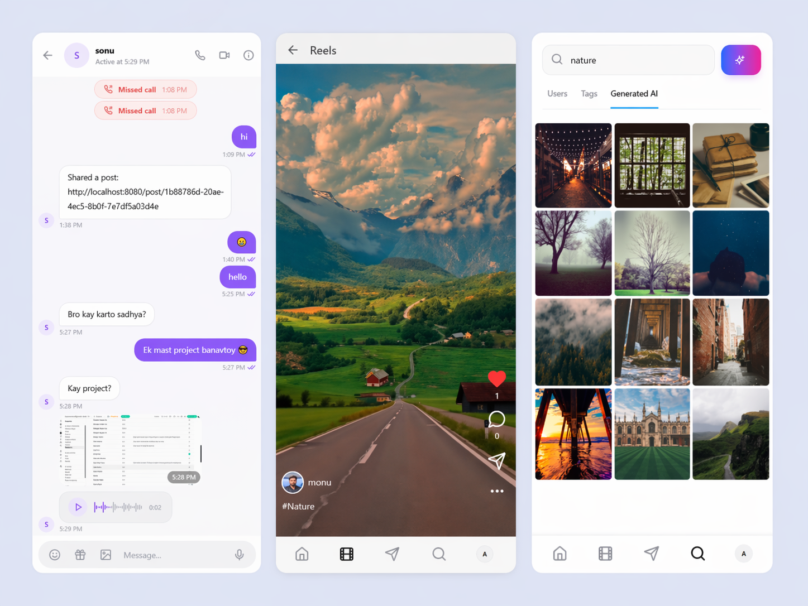

<div align="center">
  

  <h1>Connectly</h1>

  <p><strong>A full-stack Instagram-inspired social platform — built with React, TypeScript, Supabase, and real-time everything.</strong></p>

  <p>
    <a href="https://connectly.app"></a>
    &nbsp;
    
    &nbsp;
    
    &nbsp;
    
    &nbsp;
    
  </p>

</div>

---

## 📸 Screenshots

<table>
  <tr>
    <td align="center" width="50%">
      
      <br/>
      <sub><b>Home Feed · Stories · Post Cards</b></sub>
    </td>
    <td align="center" width="50%">
      
      <br/>
      <sub><b>Real-Time Messaging · DMs · Online Status</b></sub>
    </td>
  </tr>
</table>

> 🔗 **Live deployment:** [https://connectly.app](https://connectly.app)

---

## What is Connectly?

Connectly is a production-ready, full-featured social media platform inspired by Instagram. It supports posts, reels, stories, real-time messaging, WebRTC video/voice calls, hashtags, notifications, and much more — all powered by a Supabase backend with row-level security and Postgres triggers to keep counts and relationships always in sync.

Built as a modern single-page application with React 18, Vite, shadcn/ui, TanStack Query, and Framer Motion, Connectly delivers a fast, responsive, and visually polished experience across both mobile and desktop.

---

## ✨ Feature Highlights

### 📸 Feed & Content

- Infinite-scroll feed that interleaves posts and reels sorted by recency
- Multi-image carousel posts with captions and location tagging
- Like, comment, save, and share on all content types
- Hashtag support — post with `#tags`, browse by tag in Explore
- Post detail view with full comment thread

### 🎬 Reels

- Full-screen, snap-scroll vertical reel player
- Auto-play/pause on viewport enter/exit
- Double-tap to like with heart animation
- Mute/unmute toggle
- Comment drawer (mobile) / dialog (desktop)
- Share reel to any existing conversation via DM

### 📖 Stories

- 24-hour ephemeral image/video stories
- Stories row on the home feed showing active stories
- Story viewer with tap-to-advance navigation
- Story manager to create and delete your own stories

### 👤 User Profiles

- Banner image + avatar with hover-to-change upload
- Bio, website link, posts/followers/following counts
- Posts, Reels, and Saved tabs
- Follow / Unfollow with pending state for private accounts
- Followers / Following list in a glassmorphic sidebar (desktop) or bottom drawer (mobile)
- Message a user directly from their profile

### 💬 Real-Time Messaging

- Direct message conversations with live read receipts (`is_read`)
- Real-time updates via Supabase Realtime channels
- Image sharing in chat (compressed before upload)
- Voice note support
- GIF picker
- Emoji picker
- Message reactions (JSONB per-message)
- Reply-to threading
- Unread badge counters per conversation
- Online presence indicator (green dot)

### 📞 WebRTC Voice & Video Calls

- Peer-to-peer calls via `simple-peer` + Supabase DB signaling
- Offer / answer / ICE candidate exchange through `call_signals` table
- Call request / accept / decline / end signal types
- Call log messages stored per conversation (duration, status)
- Incoming call modal with ringtone UI
- Auto-cleanup of stale signals (> 2 minutes old)

### 🔔 Notifications

- Like, comment, follow, and mention notification types
- Realtime delivery via Supabase subscriptions
- Mark-as-read support
- Actor avatars and contextual links in the notification list

### 🔍 Search & Explore

- Full-text profile search (username + full name)
- Explore page with content discovery
- Hashtag browsing

### ⚙️ Settings & Personalization

- Dark / light theme toggle (persisted to `localStorage`)
- Edit profile — username, full name, bio, website, banner, avatar
- Private account toggle (follow requests instead of instant follows)
- Block / Unblock users

---

## 🗃️ Database Schema

Connectly uses 16 Postgres tables managed entirely through Supabase migrations with Row Level Security on every table.

| Table           | Purpose                                                                                |
| --------------- | -------------------------------------------------------------------------------------- |
| `profiles`      | User identity — username, avatar, banner, bio, website, privacy, online status, counts |
| `posts`         | Photo/video posts with multi-image URLs, caption, location                             |
| `comments`      | Threaded comments on posts                                                             |
| `likes`         | Polymorphic likes targeting posts, comments, or reels                                  |
| `follows`       | Follow graph with `pending` / `accepted` status                                        |
| `saved_posts`   | Bookmarked posts per user                                                              |
| `stories`       | 24-hour ephemeral media with `expires_at` enforcement via RLS                          |
| `notifications` | Like / comment / follow / mention notifications                                        |
| `reels`         | Short video posts with song name, likes, comments                                      |
| `reel_comments` | Comments specifically on reels                                                         |
| `conversations` | 1-to-1 DM threads with last-message preview                                            |
| `messages`      | Messages with text, image, voice note, GIF, reply-to, reactions                        |
| `call_signals`  | WebRTC signaling records (offer, answer, ICE, etc.)                                    |
| `blocked_users` | User block list                                                                        |
| `hashtags`      | Tag registry with post count                                                           |
| `post_hashtags` | Many-to-many join of posts and hashtags                                                |
| `close_friends` | Close-friends list per user                                                            |

All count columns (`likes_count`, `comments_count`, `followers_count`, etc.) are maintained automatically by Postgres triggers — no client-side count arithmetic needed.

### Storage Buckets

| Bucket        | Contents                |
| ------------- | ----------------------- |
| `avatars`     | Profile pictures        |
| `post-images` | Post photo uploads      |
| `story-media` | Story images and videos |
| `reel-videos` | Reel video files        |
| `chat-images` | Images shared in DMs    |
| `voice-notes` | Voice note audio files  |

All buckets are **public** with per-folder RLS so users can only write to their own `{user_id}/` prefix.

---

## 🧱 Tech Stack

| Layer             | Technology                                              |
| ----------------- | ------------------------------------------------------- |
| Framework         | React 18 + Vite 5                                       |
| Language          | TypeScript 5                                            |
| Styling           | Tailwind CSS 3 + shadcn/ui                              |
| Component Library | Radix UI primitives                                     |
| Animations        | Framer Motion 12                                        |
| Data Fetching     | TanStack Query 5 (infinite queries, cache invalidation) |
| Backend / DB      | Supabase (Postgres + Auth + Storage + Realtime)         |
| State Management  | Zustand 5 (global UI state)                             |
| Routing           | React Router DOM 6                                      |
| Forms             | React Hook Form + Zod                                   |
| P2P Calls         | simple-peer (WebRTC)                                    |
| Image Compression | browser-image-compression                               |
| Date Utilities    | date-fns                                                |
| Testing           | Vitest + Testing Library + Playwright                   |
| Linting           | ESLint 9 + TypeScript ESLint                            |
| Build             | Vite SWC plugin                                         |

---

## 📁 Project Structure

```
connectly/
├── public/
│   └── lo.png                    # App logo
│
├── src/
│   ├── components/
│   │   ├── feed/
│   │   │   ├── Feed.tsx          # Infinite-scroll feed (posts + reels interleaved)
│   │   │   ├── PostCard.tsx      # Post UI card with like/comment/save/share
│   │   │   ├── ReelCard.tsx      # Reel card for the feed
│   │   │   ├── ImageCarousel.tsx # Swipeable multi-image carousel
│   │   │   ├── CommentsSection.tsx
│   │   │   └── ShareDialog.tsx
│   │   │
│   │   ├── layout/
│   │   │   ├── AppLayout.tsx     # Root layout wrapper
│   │   │   ├── Sidebar.tsx       # Desktop navigation sidebar
│   │   │   ├── BottomNav.tsx     # Mobile bottom navigation bar
│   │   │   ├── TopNav.tsx        # Mobile top navigation bar
│   │   │   └── CreateMenu.tsx    # FAB/create content menu
│   │   │
│   │   ├── messages/
│   │   │   ├── ChatPanel.tsx     # Full chat UI (messages, input, reactions)
│   │   │   ├── ChatInfoPanel.tsx # Conversation details panel
│   │   │   ├── CallModal.tsx     # Active call UI (WebRTC)
│   │   │   ├── IncomingCallModal.tsx
│   │   │   ├── EmojiPicker.tsx
│   │   │   └── GifPicker.tsx
│   │   │
│   │   ├── stories/
│   │   │   ├── StoriesRow.tsx    # Horizontal stories strip on home feed
│   │   │   ├── StoryViewer.tsx   # Full-screen story viewer
│   │   │   └── AddStoryDialog.tsx
│   │   │
│   │   └── ui/                   # shadcn/ui component library (40+ components)
│   │
│   ├── pages/
│   │   ├── Index.tsx             # Home feed (auth-guarded)
│   │   ├── Auth.tsx              # Sign in / Sign up
│   │   ├── Profile.tsx           # User profile with posts/reels/saved tabs
│   │   ├── EditProfile.tsx       # Profile editing form
│   │   ├── Explore.tsx           # Content discovery + hashtag search
│   │   ├── Search.tsx            # User search
│   │   ├── Reels.tsx             # Vertical reel player (TikTok-style)
│   │   ├── CreatePost.tsx        # New post creation with image upload
│   │   ├── CreateReel.tsx        # New reel creation with video upload
│   │   ├── CreateStory.tsx       # New story creation
│   │   ├── StoriesManager.tsx    # Manage your stories
│   │   ├── PostDetail.tsx        # Single post + comments
│   │   ├── Messages.tsx          # Conversations list + split-pane chat (desktop)
│   │   ├── ChatRoom.tsx          # Full-page chat (mobile fallback)
│   │   ├── Notifications.tsx     # Activity feed
│   │   ├── Settings.tsx          # App settings (theme, account, privacy)
│   │   └── NotFound.tsx
│   │
│   ├── hooks/
│   │   ├── use-mobile.tsx        # Responsive breakpoint hook
│   │   └── use-toast.ts
│   │
│   ├── integrations/
│   │   └── supabase/
│   │       ├── client.ts         # Typed Supabase client
│   │       └── types.ts          # Auto-generated DB types
│   │
│   ├── lib/
│   │   ├── auth.tsx              # AuthContext + AuthProvider + useAuth
│   │   └── utils.ts             # cn() and other helpers
│   │
│   ├── App.tsx                   # Root component + route definitions
│   └── main.tsx                  # App entry point
│
├── supabase/
│   ├── migrations/               # All DB migrations as SQL files
│   └── config.toml
│
├── screenshot_feed.png           # Feed & Stories screenshot
├── screenshot_messages.png       # Messaging screenshot
├── vite.config.ts
├── tailwind.config.ts
├── tsconfig.json
└── package.json
```

---

## 🧠 Challenges & Learnings

- Designing real-time messaging without race conditions
- Managing Postgres triggers for consistent counts
- Implementing WebRTC signaling via database
- Handling complex UI state across feed, chat, and reels
- Optimizing performance with TanStack Query caching

> This project significantly improved my system design and full-stack engineering skills.

---

## 🚀 Getting Started

### Prerequisites

- Node.js 18+ (or Bun)
- A [Supabase](https://supabase.com) project

### 1. Clone the repository

```bash
git clone https://github.com/your-username/connectly.git
cd connectly
```

### 2. Install dependencies

```bash
npm install
# or
bun install
```

### 3. Configure environment variables

Create a `.env.local` file at the project root:

```env
VITE_SUPABASE_URL=https://your-project.supabase.co
VITE_SUPABASE_ANON_KEY=your-anon-key
```

You can find these in your Supabase project under **Settings → API**.

### 4. Apply database migrations

Using the Supabase CLI:

```bash
npx supabase db push
```

Or paste the migration files in `supabase/migrations/` directly into the Supabase SQL editor.

### 5. Start the development server

```bash
npm run dev
```

Open [http://localhost:8080](http://localhost:8080) in your browser.

---

## 📜 Available Scripts

| Script               | Description                         |
| -------------------- | ----------------------------------- |
| `npm run dev`        | Start local dev server on port 8080 |
| `npm run build`      | Production build                    |
| `npm run build:dev`  | Development build (for debugging)   |
| `npm run preview`    | Preview production build locally    |
| `npm run lint`       | Run ESLint                          |
| `npm run test`       | Run Vitest unit tests               |
| `npm run test:watch` | Run Vitest in watch mode            |

---

## 🔐 Authentication & Security

Authentication is handled entirely by **Supabase Auth** (email/password). On sign-up, a Postgres trigger (`handle_new_user`) automatically creates a matching row in `public.profiles`.

Every table has **Row Level Security (RLS)** enabled. Key policies:

- Users can only **write** their own rows (posts, profiles, messages, stories, etc.)
- Public content (posts, reels, profiles, comments) is **readable by everyone**
- Private content (saved posts, notifications, DMs, blocks) is **only readable by the owner**
- Private accounts use a `pending` follow status; accepted follows are gated by the followed user

---

## 📡 Real-Time Features

Supabase Realtime is enabled on four tables:

- `messages` — live chat delivery
- `conversations` — conversation list updates (last message, timestamp)
- `notifications` — instant notification delivery
- `profiles` — online/offline presence

WebRTC call signaling flows through the `call_signals` table, which is also realtime-subscribed. Stale signals older than 2 minutes are purged by a cleanup function.

---

## 🧪 Testing

Unit tests live in `src/test/` and run with Vitest + Testing Library. End-to-end tests use Playwright (config in `playwright.config.ts`).

```bash
# Unit tests
npm run test

# E2E tests
npx playwright test
```

---

## 🌍 Deployment

Connectly is optimized for deployment on any static host. The recommended approach is **Vercel**:

1. Push your repo to GitHub
2. Import into [Vercel](https://vercel.com)
3. Add `VITE_SUPABASE_URL` and `VITE_SUPABASE_ANON_KEY` as environment variables
4. Deploy

**Live instance:** [https://connectly.app](https://connectly.app)

---

## 🤝 Contributing

Pull requests are welcome. For major changes, please open an issue first to discuss what you'd like to change.

1. Fork the repository
2. Create your feature branch (`git checkout -b feature/amazing-feature`)
3. Commit your changes (`git commit -m 'feat: add amazing feature'`)
4. Push to the branch (`git push origin feature/amazing-feature`)
5. Open a Pull Request

---

## 📄 License

Distributed under the MIT License. See `LICENSE` for more information.

---

## 👨‍💻 Author

**Ambar Ubale**

- 💼 Full Stack Developer
- 🌐 Portfolio: https://your-portfolio-link.com
- 🔗 LinkedIn: https://linkedin.com/in/your-profile

> Passionate about building real-world scalable apps & modern UI experiences.

---

<div align="center">
  
  <br />
  <sub>Built with ❤️ — <strong>Connectly</strong> © 2026</sub>
</div>
